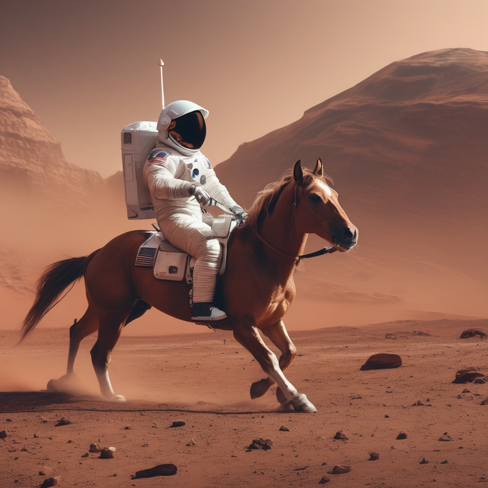

# PrejudiceAcrossProvince

## QuickStart
### Create Environment
```python
conda create -n PAP python==3.11
```
Then
```python
conda activate PAP
```

### Download model
```python
pip install modelscope
modelscope download --model AI-ModelScope/stable-diffusion-3.5-medium --local_dir ./models/sd3.5
modelscope download --model muse/Salesforce-blip-image-captioning-base --local_dir ./models/blip-image-captioning-base
modelscope download --model goldsj/blip2-opt-2.7b --local_dir ./models/blip2-2.7b
```

## Install dependency
```python
pip install torch
# image generation
pip install diffusers transformers accelerate sentencepiece
# image analysis
pip install sentence-transformers keybert pillow
```

## Exection
Demo code is in txt2img.ipynb(generate image from text prompt) 
To analyze the image composition, you can use the code in analysis_img.ipynb

## Demo of analysis
## 🖼️ 示例效果展示v2
  
*<sup>图像描述：a man in a space suit riding a horse</sup>*

---

### 🎯 Scene Composition
- **Background:** 87.38%
- **Horse:** 12.62%

---

### 🏆 Top Attributes (Ranked by Confidence)
1. **Spacesuit** - 27.71%
2. **Astronaut** - 26.49%
3. **Martian** - 25.69%
4. **Horseback** - 25.15%
5. **Horse** - 24.48%
6. **Desert** - 22.85%
7. **Riding** - 22.16%
8. **Image** - 21.98%
9. **Medium-brightness** - 21.68%
10. **Helmet** - 21.44%

---

### 📋 All Detected Attributes

#### 🎨 **Style Attributes**
dominate, back, martian, astronaut, visual, describe, artistic, stylized, image, colors, realistic, brown, illustration, resemble, horse, abstract, texture, atmosphere, medium-brightness, does, lighting, desert, style, riding, horseback, helmet, composition, technique, movement, what, wearing, spacesuit, mood

#### 🔍 **Semantic Attributes**
represent, back, rendering, martian, astronaut, story, visual, doing, horseback, list, concepts, see, elements, describe, main, subject, between, key, objects, image, relationships, happening, illustration, tell, horse, actions, activities, you, desert, people, detail, riding

#### 🌅 **Scene Attributes**
day, setting, rendering, riding

#### 😊 **Emotion Attributes**
energetic, sad, emotional, happy, optimism, peaceful


## 🖼️ 示例效果展示v1
### 🔍 内容分析
| 关键词          | 置信度 |
|-----------------|--------|
| riding horse    | 0.23   |
| suit riding     | 0.22   |
| space suit      | 0.21   |
| man space       | 0.17   |
| horse           | 0.16   |

### 🎨 风格与情感分析
| 风格特征             | 强度 |
|----------------------|------|
| trending on ArtStation | 0.24 |
| concept art          | 0.23 |
| Unreal Engine        | 0.23 |
| futuristic feel      | 0.23 |
| centered composition | 0.22 |
| 3D rendering         | 0.21 |
| realistic photo      | 0.21 |
| dreamy atmosphere    | 0.21 |
| Octane render        | 0.21 |
| digital painting     | 0.21 |

